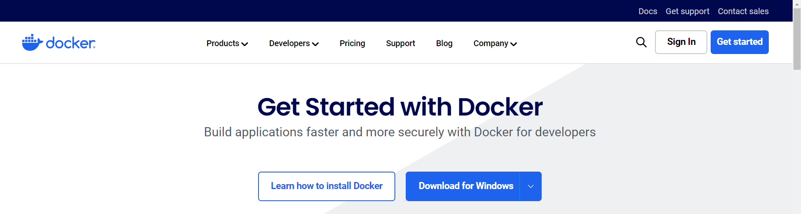
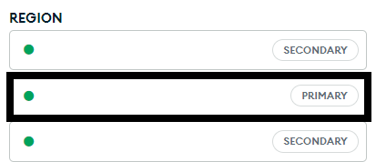

### Peliculas guardar

¡Bienvenid@ a este repositorio! Este es un proyecto realizado para poder guardar las películas que deseas ver en un futuro incluyendo también los comentarios y la media de la valoración puesta por el resto de los usuarios.
Para poder hacer el uso correcto de esta aplicación se han de seguir unos pasos donde se comentarán en la siguiente sección.

## Proceso instalación y uso de la aplicación

1. Clonar este repositorio: git clone https://github.com/gerardofv02/TrabajoMemPracticas2

2. Instalar la herramienta de proceso de desplieque Docker:

    ## Windows

    - Ir a https://www.docker.com/get-started/
    - Descargar la aplicación dándole al botón de "Download for windows"
    
    - Una vez instalado, y se tenga una cuenta de docker, se abre la aplicación.
    - Dentro de la ruta de nuestro proyecto, en la terminal, se pone el comando "docker-compose up --build"

    ## Linux

    - Seguir guia de https://docs.docker.com/engine/install/ubuntu/

3. Una vez tengamos instalado la aplicación, nos dirigimos a nuestra ruta del proyecto. Dentro de la carpeta ***back***, creamos un archivo que se llame ***.env***. Las variables que se deben contener dentro de este archivo serán las mismas que las que hay en el archivo ***env.sample***. 

4. Asignación de variables:
    - MONGO_URI: Esta variable se podrá encontrar en nuestra cuenta de mongodb online. Para encontrarla se tendría que entrar dentro del cluster que se tenga creado y sería la clave primaria (Primary) dentro de las claves que existen dentro del campo de región: 
    
    - PORT: El puerto con el que trabaja mongodb es 27017
    - MONGO_USR: Usuario de mongo para la conexión online
    - MONGO_PWD: Contraseña de mongo para la conexión online
    - DB_NAME: Nombre de la base de datos donde se guarda o se quiera guardar la información
    - JWT_SECRET: Cualquier clave que sirva de referencia para poder hacer los inicios de sesión o crear las cuentas. Siempre ha de ser la misma

5. Una vez se tenga el archivo con las variables correctamente creadas, se tendría que poner en la terminal de la ruta el comando "docker-compose up --build". Una vez se ponga el comando, ¡se podría disfrutar de la aplicación!

***IMPORTANTE: En windows la parte del back tarda más en lanzarse debido a los tiempos de conexión. Es importante esperar unos segundos***
